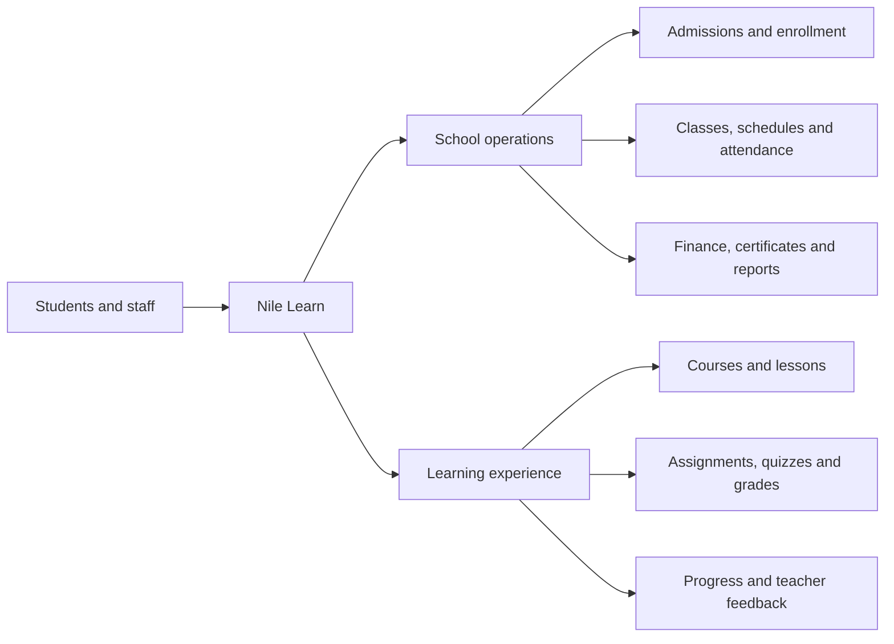
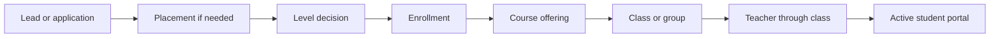
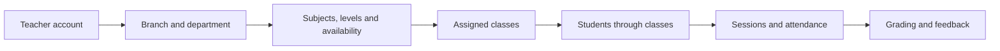
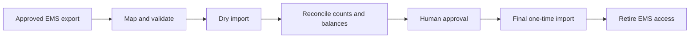

# Nile Learn Phase 1 Blueprint Report

**Prepared for:** Nile Center project blueprint review  
**Prepared on:** 14 July 2026  
**Project stage:** Tested internal alpha and Moodle CRUD foundation

> **Current architecture update, 23 July 2026:** ADR-010 makes Moodle the sole
> writable authority for Moodle-managed learning records, and ADR-011 approves
> full synthetic CRUD in the dedicated sandbox. Earlier read-only wording in
> this dated report describes the first projection milestone, not the current
> sandbox permission.

## Presentation Message

Nile Learn already has a broad, working internal platform for students and
school staff. Its routes, role restrictions, and major internal workflows have
been tested extensively. The next phase is not to add many more screens. The
next phase is to make the data, login sessions, and integrations durable and
safe for real operational use.

> Nile Learn has a strongly tested internal-alpha product and a locally proven
> production foundation. The next program is controlled activation: durable
> sessions, normalized workflow data, Moodle projection plus CRUD commands, and finally
> a reconciled one-time EMS migration.

## 1. What We Are Building

Nile Learn is intended to become the main operating platform for Nile Center.
It combines the learning experience and the school-management experience in
one role-based system.

The permanent roles are:

- Student
- Teacher
- Registrar
- Head of Department
- Branch Admin
- Super Admin

Legacy titles such as Supervisor, Guidance, or Accountant do not need separate
portals. Their valid duties should be handled through permissions inside the
five staff roles.

## 2. Current Position

The platform is a **broad internal alpha**. This means the team can demonstrate
and test complete workflows using controlled data, but the platform should not
yet be treated as the final production system for real institutional records.

| Area                       | Current status            | Plain-language meaning                                                                                                                              |
| -------------------------- | ------------------------- | --------------------------------------------------------------------------------------------------------------------------------------------------- |
| Public website             | Tested internal alpha     | Course discovery and public forms are present and tested.                                                                                           |
| Six role portals           | Tested internal alpha     | All permanent roles have protected routes and working internal workflows.                                                                           |
| Role permissions           | Tested internal alpha     | The server checks role, branch, department, class, and record ownership for covered actions.                                                        |
| School workflows           | Tested internal alpha     | Admissions, enrollment, classes, attendance, assessments, finance records, certificates, messaging, and reports work with controlled platform data. |
| Production database design | Locally proven foundation | The safer table design and security rules pass local database tests but are not the active shared production system.                                |
| Durable login sessions     | Locally proven foundation | The design passes local lifecycle tests, but the deployed runtime still uses compatibility behavior.                                                |
| Moodle integration         | CRUD foundation approved  | Full synthetic sandbox CRUD is authorized; typed command runtime and production portal activation remain in progress.                               |
| Legacy EMS migration       | Discovery complete        | Required workflows are mapped, but no production import or cutover has started.                                                                     |
| UI modernization           | In progress               | Important screens are being separated and simplified, but quality is not yet consistent across every route and display size.                        |
| External providers         | Future                    | Real payments, email, SMS, WhatsApp, meetings, and production media storage are not connected.                                                      |

## 3. Platform Coverage

The current application declares **196 route patterns** across public pages,
authentication, and the six role portals.

| Surface            | Declared route patterns | Main responsibility                                                                     |
| ------------------ | ----------------------: | --------------------------------------------------------------------------------------- |
| Public website     |                      27 | Courses, trial and placement requests, information, and public forms                    |
| Authentication     |                       8 | Login, role entry, password-reset states, and protected access                          |
| Student            |                      20 | Learning, assessment, attendance, records, messaging, support, and profile              |
| Teacher            |                      29 | Classes, sessions, materials, attendance, grading, quizzes, messages, and reports       |
| Registrar          |                      29 | Leads, applications, placement, students, enrollment, scheduling, and internal payments |
| Head of Department |                      24 | Curriculum, courses, teachers, assessments, certificates, and academic reports          |
| Branch Admin       |                      18 | Branch students, staff, classes, rooms, schedules, attendance, payments, and reports    |
| Super Admin        |                      41 | Users, roles, permissions, organization, courses, settings, audit, health, and reports  |

Route count shows product breadth. It does not by itself prove that every route
is ready for production data or external providers.

## 4. What Each Portal Can Already Demonstrate

### Student

- View assigned courses, classes, lessons, and learning progress.
- Submit assignments and quizzes.
- View grades, teacher feedback, attendance, calendar, and certificates.
- Use Quran-progress, messaging, support, reports, forms, and profile routes.
- Access only the learning records assigned to that student in the tested
  internal model.

**Status:** Strong internal-alpha workflow. Production persistence and Moodle
projection are still pending.

### Teacher

- View assigned classes and students through class membership.
- Create and manage sessions, materials, assignments, and quizzes.
- Mark attendance for assigned sessions.
- Grade submissions, review quizzes, and provide feedback.
- Use calendar, Quran review, messaging, reports, forms, and profile routes.

**Status:** Strong internal-alpha teaching workflow. It does not yet write
course activity directly to production Moodle.

### Registrar

- Create leads and applications.
- Book placement tests and record results.
- Create student profiles and enrollments.
- Assign students to courses and classes.
- Maintain internal invoices and payment records.
- Use schedules, messages, reports, settings, and admissions forms.

**Status:** Strong internal-alpha admissions workflow. Real payment processing,
EMS import, and production data activation are pending.

### Head of Department

- Review departments, programs, levels, courses, and curriculum.
- Review teacher and class progress.
- Create scoped course-delivery runs.
- Review assessments and approve, reject, or issue certificates.
- Use academic messages, reports, and forms.

**Status:** Strong internal-alpha academic-governance workflow. Moodle remains
separate and read-only integration work is incomplete.

### Branch Admin

- Review branch students, teachers, classes, and daily operations.
- Create and manage rooms and branch classes.
- Manage schedules and class-session changes.
- Review attendance exceptions and branch payment records.
- Use branch messages, reports, settings, and forms.

**Status:** Strong internal-alpha branch-operations workflow. Production branch
data and external finance communication are pending.

### Super Admin

- Manage users and staff-account foundations.
- Review roles and update permissions on their dedicated pages.
- Manage branches, departments, programs, courses, and settings.
- Review integrations, audit logs, reports, and system health.
- Use platform-wide forms and governance routes.

**Status:** Strong internal-alpha control center. Production credential,
database, monitoring, and provider operations are not active.

## 5. Core Workflow Blueprint

### Student Lifecycle

The internal-alpha workflow enforces exact placement, course, class, branch,
and teacher relationships for the covered actions. The production database
version of this complete lifecycle is still being migrated from the current
compatibility model.

### Teacher Lifecycle

### Source of Truth

| Information                                             | Intended owner                                      |
| ------------------------------------------------------- | --------------------------------------------------- |
| Identity, roles, permissions, branches, and departments | Nile Learn                                          |
| Admissions, students, guardians, and enrollment         | Nile Learn                                          |
| Classes, rooms, schedules, and attendance               | Nile Learn                                          |
| Internal finance, certificates, messages, and audit     | Nile Learn                                          |
| Moodle-managed course content and activities            | Moodle initially                                    |
| Moodle completion, attempts, grades, and feedback       | Moodle; scoped projection and audited CRUD commands |
| Legacy EMS records                                      | One-time migration source only                      |
| Images, documents, audio, and video                     | Future approved storage provider                    |

The most important rule is that the same field must never have two systems
allowed to change it.

## 6. Verification Evidence

The latest full regression run completed successfully:

- **1,598 portal checks passed, 0 failed**.
- **572 unit tests passed across 50 files**.
- **73 focused Moodle tests passed**.
- TypeScript validation passed.
- The production build passed.
- Local database, session, and Nile Forms safety gates passed.

Portal QA covers all six roles, route denials, major workflows, desktop and
mobile route matrices, accessibility checks, responsive overflow checks, and
browser console errors.

### What These Results Prove

- The current internal-alpha routes and controlled workflows behave as
  expected.
- Role restrictions and scoped actions are tested for the covered cases.
- Major student, teacher, registrar, HOD, branch, and admin workflows work
  together in the current model.
- The current build can be produced successfully.

### What These Results Do Not Prove

- Safe production-scale storage of real institutional data.
- Durable login across multiple servers and deployments.
- Production backup, restore, monitoring, and disaster recovery.
- Production Moodle portal activation or a completed EMS migration.
- Real payment, message delivery, meeting, or media providers.
- Performance under real user volume or large historical datasets.

## 7. Moodle CRUD Readiness

Moodle is being treated as the initial learning-content and activity engine,
not as the owner of all school operations.

### Proven

- A hardened server-side client with exact operation manifests.
- Sanitized models that avoid copying private provider payloads.
- Reversible sandbox proofs for synthetic user, enrollment, group, course, and
  content lifecycles.
- Replay did not create duplicates.
- Cleanup removed the temporary records and the retired token was rejected.
- The historical read campaign reached closure; ADR-011 now authorizes the
  complete CRUD campaign.

### Remaining Moodle Limits

- The `local_nilelearn` plugin, command worker, and signed launches still need
  operation-family implementation and sandbox acceptance.
- No portal currently activates production Moodle CRUD.
- Production mappings, scheduled synchronization, reconciliation, and
  monitoring are not implemented.
- Production Moodle writes remain blocked until command, audit, retry,
  reconciliation, RBAC, and rollback gates are accepted.

**Moodle status:** Full synthetic sandbox CRUD approved; production activation
is not yet accepted.

## 8. Legacy EMS Position

Read-only discovery confirmed the main responsibilities required in the new
platform:

- Registrar admissions and placement flow.
- Student records, course assignment, and class scheduling.
- Teacher class and learner visibility.
- HOD academic supervision.
- Branch operations and finance oversight.
- Moodle user and course identifiers used by the legacy process.

The new system should preserve the valid workflows but not copy the old UI,
security weaknesses, invalid record states, or unclear role boundaries.

The legacy EMS should be handled as a **finite migration source**:

No production EMS import or cutover has started.

## 9. Data and Login Foundation

The safer production design has been prepared and tested locally:

- A normalized identity, role, scope, session, audit, integration, and
  migration schema.
- Strict database access rules that deny direct browser access to sensitive
  tables.
- Atomic session creation and revocation with replay and conflict protection.
- Nile Forms service-only tables and controlled command boundaries.

However, the active application still depends on a compatibility state model,
and memory remains the default session behavior. These are acceptable for a
controlled alpha but not for production across multiple servers.

The project should not move all workflows to Supabase in one large cutover.
Each workflow should be migrated, compared, tested, and approved separately.

## 10. UI and Device Position

The current QA checks desktop and mobile routes, accessibility, and horizontal
overflow. Important route families have already been separated so one page has
one main job.

The UI is still not consistently complete across every route, screen size,
language, and classroom display. The remaining program should continue in this
order:

1. Stabilize the shared app shell, navigation, and header.
2. Establish one excellent reference dashboard.
3. Separate crowded list, detail, create, report, and settings pages.
4. Review one route family at a time on mobile, laptop, desktop, ultrawide,
   classroom display, and RTL.
5. Improve visual charts only after their underlying data is authoritative.

UI work must not be used to hide incomplete business logic or external data.

## 11. Main Limitations and Risks

| Priority | Limitation                                             | Why it matters                                              | Required response                                         |
| -------- | ------------------------------------------------------ | ----------------------------------------------------------- | --------------------------------------------------------- |
| Critical | Production data is not yet the active normalized model | Multiple servers could disagree or lose consistent state    | Activate workflow data in controlled staging slices       |
| Critical | Runtime sessions are not fully durable                 | Restart or multiple servers can affect login and revocation | Activate and test durable sessions before production      |
| High     | Moodle is not connected to portal workflows            | Course data can become duplicated or stale                  | Finish read contracts, mappings, and reconciliation first |
| High     | EMS migration has not run                              | Historical records and balances are not yet proven          | Obtain immutable export and run reconciled dry imports    |
| High     | Real file storage is absent                            | Passports, images, media, and documents need safe retention | Approve storage, privacy, scanning, and access policy     |
| High     | UI quality remains uneven                              | Staff may struggle on large screens or crowded routes       | Continue Simple UI route-by-route rollout                 |
| Medium   | External delivery providers are absent                 | Messages, meetings, and payments are internal placeholders  | Add providers only after internal authority is stable     |
| Medium   | Production-scale performance is unproven               | Alpha data does not represent real volume                   | Add staging load, concurrency, backup, and recovery tests |

## 12. Recommended Delivery Roadmap

### Stage 1 - Protect and Checkpoint the Alpha

- Reconcile and commit the current plans, decisions, tests, and evidence.
- Preserve the 1,598/0 portal baseline.
- Rotate any previously exposed credentials before production use.

### Stage 2 - Activate the Production Foundation in Staging

- Promote the approved identity, scope, session, audit, and integration schema
  to a managed staging project.
- Prove backup, rollback, monitoring, and strict access rules.
- Activate durable sessions and test login, logout, role switching, expiry,
  revocation, restarts, and multiple application instances.

### Stage 3 - Migrate Internal Workflows One at a Time

Recommended order:

1. Admissions and student lifecycle.
2. Course delivery, classes, rooms, and schedules.
3. Attendance and exceptions.
4. Assignments, quizzes, grading, and progress.
5. Finance, certificates, messages, and reports.

Each workflow needs data comparison, role-scope tests, audit evidence,
rollback, and full portal QA before the next workflow begins.

### Stage 4 - Complete Moodle Projection And Sandbox CRUD

- Close the five H5P/SCORM fixture checks and reach 31/31.
- Add stable external-ID mappings.
- Import provider data into scoped projections.
- Prove full synthetic create, read, update, archive/restore, and safe delete
  lifecycles through typed Moodle commands.
- Add synchronization status, reconciliation, retries, and operator review.
- Keep Nile-owned attendance, schedules, messages, finance, certificates, and
  private documents out of Moodle write authority.

### Stage 5 - Migrate and Retire the Legacy EMS

- Obtain an immutable export and field dictionary.
- Define record and balance reconciliation rules.
- Run repeated dry imports.
- Approve the final cutover window.
- Import once, reconcile, and retire legacy credentials.

### Stage 6 - Add Providers and Finish UI V2

- Add production storage, notifications, meetings, and payments as separate
  approved projects.
- Complete the route-by-route UI program and classroom-display review.
- Run accessibility, RTL, performance, backup, recovery, and operational
  readiness reviews.

## 13. Presentation Decision

### Ready For

- Architecture and blueprint review.
- Internal demonstrations using controlled data.
- Workflow validation with school stakeholders.
- Controlled staging preparation.
- Route-by-route UI review.

### Not Ready For

- Production launch with real institutional data.
- Claiming completed Moodle or EMS integration.
- Real payment or communication delivery.
- Production storage of private student documents.
- Replacing the old systems before migration and reconciliation are approved.

## 14. Decisions Required From the Team

1. Approve the source-of-truth boundaries between Nile Learn and Moodle.
2. Approve the staged database and durable-session activation plan.
3. Define the legacy EMS export, reconciliation, and retirement process.
4. Select the production file-storage and privacy model.
5. Select future payment, communication, and meeting providers.
6. Confirm retention rules for student documents, audit, finance, and learning
   records.
7. Confirm which route family will be the UI V2 reference implementation.

## 15. Final Assessment

Nile Learn is significantly beyond a visual prototype. It contains a broad
role-based product, tested internal workflows, strong role and scope checks,
local database and session foundations, and real Moodle sandbox evidence.

The remaining work is mainly controlled production activation and integration,
not uncontrolled feature expansion. The project should advance by protecting
the current alpha, activating durable identity and data foundations in staging,
migrating one workflow at a time, completing Moodle projections and CRUD command evidence, and
only then carrying out the one-time EMS migration and external-provider rollout.

## Evidence Used

- `docs/NILE_LEARN_MASTER_PLAN.md`
- `docs/internal-admin-workflows.md`
- `docs/legacy-ems-discovery.md`
- `docs/production-persistence-architecture.md`
- `docs/qa-baseline.md`
- `docs/MOODLE_INTEGRATION_EXECUTION_PLAN.md`
- `docs/moodle-m2b-write-proof-evidence-20260713.md`
- `docs/moodle-m2c-read-closure-evidence-20260713.md`
- `client/src/App.tsx`
- Current domain, server authority, repository, migration, and test files
