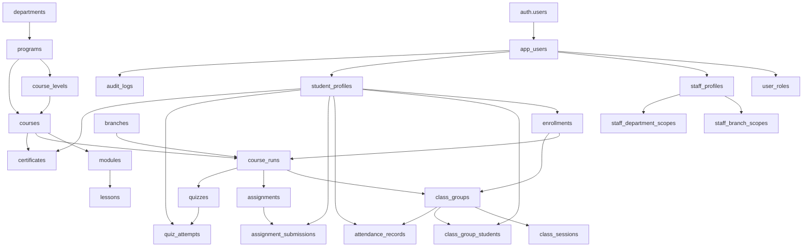

# Nile Learn Production Persistence Architecture

## Purpose

This document defines the production persistence plan for Nile Learn before any normalized Supabase/Postgres migration is implemented.

The platform is in internal alpha stabilization. The current protected baseline is 921 portal QA checks and 0 failures. This plan must not be treated as permission to connect live Moodle, EMS, payments, email/SMS/WhatsApp, meetings, or production media storage.

## Sources

- `CLAUDE.md`
- `AGENTS.md`
- `.codex/prompts/00-discovery.md`
- `docs/internal-admin-workflows.md`
- `docs/qa-baseline.md`
- `client/src/lib/domain/types.ts`
- `client/src/lib/domain/actions.ts`
- `client/src/lib/domain/seed.ts`
- `client/src/lib/domain/store.ts`
- `server/auth.ts`
- `server/routes.ts`
- `server/platformState.ts`
- `server/platformRepository.ts`

Supabase planning rules used:

- Enable RLS on exposed tables.
- Do not rely on browser/client state for authorization.
- Do not put authorization facts in user-editable metadata.
- Use `app_metadata` or server-owned profile tables for roles/scopes.
- Avoid `TO authenticated` policies without row predicates.
- Add indexes on foreign keys and RLS predicate columns.
- Keep service credentials server-side only.

## Current State Map

### Current Authority

The current application authority is a server-side platform snapshot:

- `server/platformRepository.ts` defines the `PlatformRepository` boundary.
- The default adapter reads/writes the current snapshot shape and falls back to local `.local-data/platform-state.json`.
- `server/platformState.ts` is the server-side action gate. It parses workflow actions, derives the actor from the session, checks role/scope, applies domain mutations, persists the next snapshot, and returns a scoped state.
- `client/src/lib/domain/store.ts` uses `localStorage` as a demo cache and syncs actions through `/api/platform/state/actions`.

### Current Persistence Shape

Current server persistence stores one denormalized `PlatformState` snapshot plus optional event rows.

Current `PlatformState` includes:

- identity: `users`, `staffProfiles`, `permissions`
- organization: `branches`, `departments`
- academics: `programs`, `levels`, `courses`, `modules`, `lessons`, `resources`, `courseRuns`, `classGroups`
- learning: `students`, `teachers`, `enrollments`, `lessonProgress`
- assessments: `assignments`, `assignmentSubmissions`, `quizzes`, `questionBankItems`, `quizQuestionPreviews`, `quizAttempts`, `grades`
- operations: `events`, `classSessions`, `teacherAvailability`, `rooms`, `meetingLinks`, `attendance`
- admissions: `leads`, `applications`, `placementTests`, `placementResults`, `enrollmentWorkflows`
- finance: `invoices`, `payments`, `packages`, `discounts`
- certificates: `certificates`
- Quran: `quranPlans`, `quranProgress`, `recitationSubmissions`
- communication: `messages`, `communicationLogs`, `messageTemplates`, `documents`, `notifications`, `supportTickets`
- reporting/evidence: `reportPresets`, `auditLogs`
- platform: `settings`, `integrations`

### Current Gaps

- Snapshot persistence is not normalized.
- Server sessions are in-memory and not durable.
- Client `localStorage` still exists as a demo cache.
- Supabase Auth can sign in, but normalized profile/role tables are not yet the production authority.
- External integrations are placeholders.
- File/media records store URLs only; production storage is not wired.
- RLS policies do not yet exist for normalized tables because those tables do not exist yet.

## Target Architecture

The target architecture preserves the current product relationship model:

`User -> Role -> Profile -> Branch/Department Scope -> Permissions -> Portal Access -> Workflow Actions -> Audit Logs`

Student relationship:

`Student -> Branch -> Placement/Level -> Enrollment -> Course -> Class/Group -> Teacher -> Attendance -> Assignments/Quizzes -> Grades -> Certificate`

Teacher relationship:

`Teacher -> Branch -> Department -> Subjects -> Availability -> Classes -> Students through Classes -> Attendance -> Grading -> Feedback`

### Server Boundary

Production writes must flow through server actions or server repository methods.

Browser clients may read their scoped data, but they must not be the authority for:

- role
- permission
- branch scope
- department scope
- actor identity
- ownership
- session expiry
- student/class/teacher assignment
- payment status
- certificate status
- audit logs

### Repository Boundary

`PlatformRepository` should evolve in phases:

1. Current adapter: snapshot/local fallback.
2. Read-model adapter: normalized Postgres reads mapped back into `PlatformState`.
3. Dual-write adapter: normalized writes plus snapshot compatibility for QA comparison.
4. Normalized adapter: normalized Postgres is the source of truth; snapshot is removed or kept only as export/debug.

The repository interface should stay focused on domain operations, not table names. Later adapters should expose methods such as:

- `getScopedState(session)`
- `runAction(action, session)`
- `createUser(input, actor)`
- `createStudent(input, actor)`
- `saveAttendance(input, actor)`
- `gradeSubmission(input, actor)`
- `approveCertificate(input, actor)`
- `writeAudit(input)`

## Proposed Normalized Tables

Naming rules:

- Use lowercase snake_case table and column names.
- Use UUID primary keys for production-created rows.
- Keep legacy/demo IDs only in seed/demo mapping columns during migration.
- Add `created_at`, `updated_at`, and where useful `created_by`, `updated_by`.
- Index every foreign key.
- Index every RLS predicate column, especially `user_id`, `branch_id`, `department_id`, `student_id`, `teacher_id`, `course_run_id`, and `class_group_id`.

### Identity And Access

| Table                     | Purpose                                                        | Key columns                                                                                           |
| ------------------------- | -------------------------------------------------------------- | ----------------------------------------------------------------------------------------------------- |
| `app_users`               | Server-owned app identity mapped to Supabase Auth              | `id`, `auth_user_id`, `name`, `email`, `phone`, `active_role`, `status`, `branch_id`, `department_id` |
| `user_roles`              | Multi-role assignment                                          | `id`, `user_id`, `role`, `status`                                                                     |
| `role_permissions`        | Permission matrix                                              | `id`, `role`, `permission`, `granted`, `updated_by`                                                   |
| `staff_profiles`          | Staff role profile for teacher/registrar/HOD/branch/superadmin | `id`, `user_id`, `role`, `permission_scope`, `title`, `availability_status`, `status`                 |
| `staff_branch_scopes`     | Branch scope join table                                        | `id`, `staff_profile_id`, `branch_id`                                                                 |
| `staff_department_scopes` | Department scope join table                                    | `id`, `staff_profile_id`, `department_id`                                                             |
| `staff_subjects`          | Teacher/staff subjects and levels                              | `id`, `staff_profile_id`, `subject`, `teaching_level`                                                 |

Rules:

- Supabase `auth.users` owns login identity.
- `app_users.auth_user_id` references `auth.users.id` where available.
- Authorization uses `app_users`, `user_roles`, and scope tables, not browser claims.
- Supabase Auth `app_metadata` may cache role IDs for UX, but database/server profile tables remain authoritative.

### Organization

| Table                 | Purpose                           | Key columns                                           |
| --------------------- | --------------------------------- | ----------------------------------------------------- |
| `branches`            | Branches and online/global scopes | `id`, `name`, `code`, `timezone`, `address`, `status` |
| `departments`         | Academic/admin departments        | `id`, `name`, `owner_user_id`, `status`               |
| `department_branches` | Department branch coverage        | `id`, `department_id`, `branch_id`                    |

### Academic Catalog

| Table                           | Purpose                      | Key columns                                                                 |
| ------------------------------- | ---------------------------- | --------------------------------------------------------------------------- |
| `programs`                      | Program family               | `id`, `title`, `category`, `department_id`, `language`, `status`            |
| `course_levels`                 | Level ladder inside programs | `id`, `program_id`, `title`, `sort_order`                                   |
| `course_level_prerequisites`    | Level prerequisites          | `id`, `level_id`, `prerequisite_level_id`                                   |
| `course_level_completion_rules` | Completion rules             | `id`, `level_id`, `rule`                                                    |
| `courses`                       | Course catalog               | `id`, `program_id`, `level_id`, `slug`, `title`, `description`, `status`    |
| `course_outcomes`               | Course outcomes              | `id`, `course_id`, `outcome`, `sort_order`                                  |
| `modules`                       | Curriculum modules           | `id`, `course_id`, `title`, `sort_order`                                    |
| `module_outcomes`               | Module outcomes              | `id`, `module_id`, `outcome`, `sort_order`                                  |
| `lessons`                       | Lessons                      | `id`, `module_id`, `title`, `lesson_type`, `duration_minutes`, `sort_order` |
| `lesson_resources`              | Resource metadata only       | `id`, `lesson_id`, `title`, `resource_type`, `url`, `published`             |

Resource URLs remain placeholders until production file/media storage is approved.

### Classes And Scheduling

| Table                  | Purpose                        | Key columns                                                                                                         |
| ---------------------- | ------------------------------ | ------------------------------------------------------------------------------------------------------------------- |
| `course_runs`          | Course offering in term/branch | `id`, `course_id`, `branch_id`, `teacher_id`, `term`, `starts_on`, `ends_on`, `status`                              |
| `class_groups`         | Roster group                   | `id`, `course_run_id`, `name`, `capacity`, `schedule`, `room_id`, `meeting_link_id`                                 |
| `class_group_students` | Roster membership              | `id`, `class_group_id`, `student_id`, `status`                                                                      |
| `class_sessions`       | Attendance session             | `id`, `class_group_id`, `event_id`, `title`, `starts_at`, `ends_at`, `status`, `attendance_saved`                   |
| `calendar_events`      | Calendar source events         | `id`, `event_type`, `title`, `starts_at`, `ends_at`, `owner_id`, `branch_id`, `room_id`, `class_group_id`, `status` |
| `teacher_availability` | Teacher availability blocks    | `id`, `teacher_id`, `weekday`, `starts_at`, `ends_at`, `branch_id`                                                  |
| `rooms`                | Branch rooms                   | `id`, `branch_id`, `name`, `capacity`, `status`                                                                     |
| `room_equipment`       | Room equipment items           | `id`, `room_id`, `equipment`                                                                                        |
| `meeting_links`        | Placeholder meeting metadata   | `id`, `provider`, `url`, `status`                                                                                   |

### Students And Admissions

| Table                     | Purpose                   | Key columns                                                                                                                                                                                                        |
| ------------------------- | ------------------------- | ------------------------------------------------------------------------------------------------------------------------------------------------------------------------------------------------------------------ |
| `student_profiles`        | Student profile           | `id`, `user_id`, `status`, `source`, `guardian_name`, `guardian_phone`, `current_level`, `age_group`, `course_interest`, `country`, `preferred_language`, `timezone`, `notes`                                      |
| `leads`                   | Lead intake               | `id`, `full_name`, `email`, `phone`, `country`, `subject`, `source`, `status`, `notes`, `created_at`                                                                                                               |
| `applications`            | Application file          | `id`, `lead_id`, `branch_id`, `course_interest`, `schedule_preference`, `status`                                                                                                                                   |
| `placement_test_bookings` | Placement booking         | `id`, `lead_id`, `full_name`, `email`, `phone`, `branch_id`, `subject`, `preferred_date`, `current_level`, `status`, `recommended_level`                                                                           |
| `placement_test_results`  | Placement outcome         | `id`, `booking_id`, `examiner_id`, `score`, `recommended_level`, `notes`, `created_at`                                                                                                                             |
| `enrollment_workflows`    | Admissions workflow state | `id`, `lead_id`, `application_id`, `student_id`, `placement_test_id`, `target_course_id`, `course_run_id`, `target_level_id`, `recommended_level`, `class_group_id`, `source`, `status`, `next_step`, `updated_at` |
| `enrollments`             | Active/past enrollment    | `id`, `student_id`, `course_run_id`, `level_id`, `class_group_id`, `teacher_id`, `source`, `status`, `progress`, `attendance_rate`, `current_grade`, `created_at`                                                  |

### Learning Progress And Assessment

| Table                        | Purpose                 | Key columns                                                                                                        |
| ---------------------------- | ----------------------- | ------------------------------------------------------------------------------------------------------------------ |
| `lesson_progress`            | Student lesson state    | `id`, `student_id`, `lesson_id`, `status`, `completed_at`, `notes`                                                 |
| `assignments`                | Assignment config       | `id`, `course_run_id`, `title`, `due_at`, `submission_type`, `status`                                              |
| `assignment_rubric_items`    | Assignment rubric lines | `id`, `assignment_id`, `rubric_item`, `sort_order`                                                                 |
| `assignment_submissions`     | Student submissions     | `id`, `assignment_id`, `student_id`, `submitted_at`, `status`, `response`, `score`, `feedback`                     |
| `quizzes`                    | Quiz config             | `id`, `course_run_id`, `title`, `due_at`, `duration_minutes`, `attempts_allowed`, `status`                         |
| `question_bank_items`        | Question bank           | `id`, `course_run_id`, `prompt`, `question_type`, `difficulty`, `answer_key`, `created_by`, `updated_at`, `status` |
| `question_bank_choices`      | Question choices        | `id`, `question_id`, `choice`, `sort_order`                                                                        |
| `question_bank_tags`         | Question tags           | `id`, `question_id`, `tag`                                                                                         |
| `question_bank_rubric_items` | Question rubric items   | `id`, `question_id`, `rubric_item`, `sort_order`                                                                   |
| `quiz_questions`             | Quiz-question join      | `id`, `quiz_id`, `question_id`, `sort_order`                                                                       |
| `quiz_attempts`              | Student attempts        | `id`, `quiz_id`, `student_id`, `started_at`, `submitted_at`, `status`, `score`, `max_score`                        |
| `quiz_attempt_answers`       | Attempt answers         | `id`, `attempt_id`, `question_id`, `answer`                                                                        |
| `grades`                     | Gradebook rows          | `id`, `student_id`, `course_run_id`, `item_id`, `item_title`, `score`, `max_score`, `feedback`                     |

### Attendance

| Table                | Purpose            | Key columns                                                           |
| -------------------- | ------------------ | --------------------------------------------------------------------- |
| `attendance_records` | Session attendance | `id`, `class_group_id`, `student_id`, `session_id`, `status`, `notes` |

Constraints:

- Unique attendance record per `class_group_id`, `student_id`, `session_id`.
- `student_id` must belong to the `class_group_id` roster.
- Teacher writes must go through assigned `course_runs.teacher_id`.
- Branch admin writes must be branch scoped through `course_runs.branch_id`.

### Finance

| Table       | Purpose                   | Key columns                                                              |
| ----------- | ------------------------- | ------------------------------------------------------------------------ |
| `packages`  | Internal package catalog  | `id`, `title`, `course_id`, `amount`, `currency`, `sessions`, `status`   |
| `discounts` | Internal discount catalog | `id`, `code`, `amount`, `currency`, `status`                             |
| `invoices`  | Internal invoice records  | `id`, `student_id`, `amount`, `currency`, `due_at`, `status`             |
| `payments`  | Internal payment records  | `id`, `invoice_id`, `amount`, `method`, `reference`, `paid_at`, `status` |

No payment gateway is part of this phase.

### Certificates

| Table          | Purpose                          | Key columns                                                                                                                                                                                          |
| -------------- | -------------------------------- | ---------------------------------------------------------------------------------------------------------------------------------------------------------------------------------------------------- |
| `certificates` | Certificate approval/issue state | `id`, `student_id`, `course_id`, `status`, `grade`, `attendance_rate`, `verification_code`, `approved_by`, `approved_at`, `issued_by`, `issued_at`, `rejected_by`, `rejected_at`, `rejection_reason` |

Constraints:

- `verification_code` unique.
- Issued certificates are public-verifiable by code only through a restricted read path.

### Quran

| Table                      | Purpose                       | Key columns                                                                       |
| -------------------------- | ----------------------------- | --------------------------------------------------------------------------------- |
| `quran_memorization_plans` | Student Quran plan            | `id`, `student_id`, `target`, `current_juz`, `revision_cycle`, `teacher_id`       |
| `quran_progress_records`   | Progress by surah/juz         | `id`, `student_id`, `surah`, `juz`, `memorized_percent`, `tajweed_score`, `notes` |
| `recitation_submissions`   | Recitation review placeholder | `id`, `student_id`, `teacher_id`, `title`, `submitted_at`, `status`, `feedback`   |

Audio/video storage is future work.

### Communication

| Table                | Purpose                         | Key columns                                                                               |
| -------------------- | ------------------------------- | ----------------------------------------------------------------------------------------- |
| `messages`           | In-app messages                 | `id`, `from_user_id`, `to_user_id`, `subject`, `body`, `read`, `created_at`               |
| `communication_logs` | Internal communication evidence | `id`, `actor_id`, `channel`, `subject`, `body`, `related_user_id`, `status`, `created_at` |
| `message_templates`  | Template library                | `id`, `title`, `channel`, `subject`, `body`, `category`, `status`                         |
| `notifications`      | In-app notifications            | `id`, `user_id`, `title`, `body`, `href`, `read`, `created_at`                            |
| `support_tickets`    | Internal support requests       | `id`, `requester_id`, `subject`, `status`, `priority`, `last_updated_at`                  |

No external email/SMS/WhatsApp sending is part of this phase.

### Documents And Media Metadata

| Table       | Purpose       | Key columns                                                 |
| ----------- | ------------- | ----------------------------------------------------------- |
| `documents` | Metadata only | `id`, `owner_id`, `title`, `document_type`, `url`, `status` |

Production storage buckets and signed URLs are future work.

### Reports, Audit, Settings, Integrations

| Table                  | Purpose                       | Key columns                                                                                                          |
| ---------------------- | ----------------------------- | -------------------------------------------------------------------------------------------------------------------- |
| `report_presets`       | Saved report views            | `id`, `owner_user_id`, `role`, `label`, `report_type`, `search`, `status`, `row_count`, `created_at`                 |
| `audit_logs`           | Immutable audit evidence      | `id`, `actor_id`, `action`, `entity_type`, `entity_id`, `summary`, `created_at`, `request_payload`, `result_payload` |
| `integration_configs`  | Placeholder integration state | `id`, `label`, `status`, `server_only`, `last_sync_at`, `notes`                                                      |
| `integration_env_vars` | Expected env var names only   | `id`, `integration_id`, `env_var`                                                                                    |
| `platform_settings`    | Global settings               | `id`, `organization`, `default_language`, `academic_term`, `retention_days`, `updated_at`, `updated_by`              |

Integration config tables must never store real provider secrets in browser-visible columns.

## Entity Relationship Summary

## RLS And Security Boundary Plan

### General RLS Rules

- Enable RLS on every application table in any exposed schema.
- Prefer private schemas for helper functions and internal lookup helpers.
- Do not rely on `TO authenticated` alone. Every policy needs an ownership, branch, department, or role predicate.
- Use `(select auth.uid())` in policies to avoid repeated function execution per row.
- Add indexes for all RLS predicate columns.
- Use `USING` and `WITH CHECK` for updates.
- Never base RLS on `raw_user_meta_data`.
- Avoid public `SECURITY DEFINER` functions. If needed, keep them in a private schema, check `auth.uid()` inside the function, set `search_path = ''`, and revoke execute from `PUBLIC`.

### Helper Tables For RLS

RLS should resolve app identity through:

- `app_users.auth_user_id = (select auth.uid())`
- `user_roles.user_id`
- `staff_branch_scopes.branch_id`
- `staff_department_scopes.department_id`
- `student_profiles.user_id`
- class and enrollment joins for student/teacher ownership

### Role Access Model

Student:

- May read own `student_profiles`, enrollments, class groups through enrollment, assigned learning records, own attendance, own grades, own certificates, own Quran records, own messages/notifications.
- May insert/update only own learning actions through server actions, not direct broad table writes.

Teacher:

- May read assigned course runs/classes and students through class roster/enrollments.
- May save attendance only for assigned class sessions.
- May grade/review only submissions/attempts for assigned class students.
- May update Quran progress/recitation review only for assigned students.

Registrar:

- May manage leads, applications, placement, students, enrollments, and internal payments within assigned branch/admissions scope.
- Must not access branch/admin/global settings outside scope.

HOD:

- May read department courses, teachers, classes, assessments, certificates, and academic reports within department/branch scope.
- May approve/reject academic/certificate items in scope.

Branch admin:

- May read branch users, rooms, schedule, class operations, attendance exceptions, internal payments, and branch reports for assigned branch.
- Must not edit global settings or curriculum unless a future permission explicitly allows it.

Super admin:

- May manage all internal data.
- Sensitive writes must create audit logs.

### Public/Anon Access

Anon access should be limited to:

- public catalog read models, if exposed intentionally
- certificate verification by code through a controlled endpoint or tightly scoped view
- public lead/application/placement intake through server endpoints with validation and rate limiting

Anon must not have direct table access to operational, financial, learning, profile, or audit data.

## Server-Authoritative Data

These must become server-authoritative in normalized persistence:

- users, roles, permissions
- branches, departments, scopes
- student and staff profiles
- leads, applications, placement results, enrollment workflows
- enrollments, course runs, class groups, rosters
- attendance, assignment submissions, quiz attempts, grades
- invoices, payments
- certificates and verification codes
- messages, notifications, communication logs
- audit logs
- integration configs and platform settings

## Local/Demo-Only Data

These may remain local/demo-only during alpha:

- seed data fixtures
- portal QA fixture reset state
- local demo users and short test emails
- client `localStorage` cache for demo UX
- `.local-data/platform-state.json`
- snapshot compatibility tables used only for migration comparison

## Client `localStorage` Rules

Allowed:

- cache the scoped demo state for immediate UI responsiveness
- store non-authoritative UI preferences
- preserve draft form values if they do not include secrets
- drive local QA flows

Not allowed:

- authorize roles or permissions
- determine branch/department scope
- decide student/teacher ownership
- store service keys or provider secrets
- mark payments/certificates/grades as authoritative
- override server action results
- act as production session storage

## Migration Phases

### Phase 0: Protected Alpha Baseline

Status: completed.

- Tag baseline: `alpha-qa-921-0-2026-07-04`.
- Keep portal QA clean at 921/0.
- Add server-side RBAC/scope tests.
- Add `PlatformRepository` boundary.

### Phase 1: Schema Design And Dry-Run Migrations

No runtime behavior change.

- Create migration drafts for identity, organization, academics, students, classes, attendance, assessment, finance, certificates, communication, audit, settings, and integration config tables.
- Add RLS policies in the migration draft.
- Add indexes for all foreign keys and RLS predicate columns.
- Add seed scripts using fake demo data only.
- Run Supabase advisors before applying to a shared environment.

### Phase 2: Repository Read Adapter

Keep behavior equivalent.

- Add a Postgres-backed adapter behind `PlatformRepository`.
- Map normalized reads back into the existing `PlatformState` read model.
- Keep the snapshot adapter as default unless explicitly enabled.
- Add parity tests comparing seed snapshot output with normalized read output.

### Phase 3: Server Action Writes

Keep client routes stable.

- Move one workflow at a time to normalized writes.
- Start with low-risk workflows: audit logs, report presets, settings, and branch/room operations.
- Then move attendance, admissions, student lifecycle, teacher lifecycle, grading, certificates.
- For each workflow, prove action result parity and portal QA stability.

### Phase 4: Durable Sessions And Auth Hardening

After profile/role tables exist:

- Persist sessions or rely on verified Supabase sessions with server-side checks.
- Map Supabase users to `app_users`.
- Keep role/scope authority in server-owned tables.
- Refresh role/scope data server-side on sensitive actions.

### Phase 5: Snapshot Retirement

Only after parity is proven:

- Stop writing snapshot as primary state.
- Keep snapshot export only for QA/debug if still useful.
- Remove assumptions that all data can be loaded as one large `PlatformState`.

### Phase 6: External Integrations

Only after internal workflows, normalized persistence, durable sessions, RLS, and QA are stable:

- Moodle sync
- old EMS/register sync
- payment gateway
- email/SMS/WhatsApp sending
- meeting provider
- production file/media storage

## Tests Needed Before Migration

Repository parity:

- normalized adapter returns the same shape as the snapshot adapter for seeded data
- action results match existing domain action results
- audit logs are written for every sensitive action

RLS and scope:

- student cannot read another student profile, attendance, grades, certificates, messages, or Quran records
- teacher cannot read or mutate unrelated classes/students
- registrar cannot create/convert/update outside branch scope
- HOD cannot access finance/global settings or unrelated department data
- branch admin cannot access other branches or global admin settings
- super admin can perform global actions

Workflow:

- lead/application -> placement -> student -> enrollment -> class -> active portal
- teacher assignment -> class roster -> attendance -> grading -> feedback
- registrar payment record links to invoice/enrollment/student
- HOD certificate approval/rejection/issue state transitions
- branch room/schedule/attendance exception flows
- admin user/role/permission/audit flows

Performance:

- indexes exist for all foreign keys
- indexes exist for all RLS predicates
- report queries paginate
- large audit/report reads avoid loading full state

Migration safety:

- seed fake demo data only
- migration can be rolled back in local/dev
- data backfill preserves current demo relationships
- portal QA remains 921/0 after each adapter phase

## Files Likely To Change Later

- `supabase/migrations/*`
- `supabase/seed.sql` or dedicated seed scripts
- `server/platformRepository.ts`
- `server/platformState.ts`
- `server/auth.ts`
- `server/routes.ts`
- `server/supabase.ts`
- `client/src/lib/domain/types.ts`
- `client/src/lib/domain/actions.ts`
- `client/src/lib/domain/store.ts`
- `client/src/lib/auth/server-platform-repository.test.ts`
- `client/src/lib/auth/server-platform-state.test.ts`
- `client/src/lib/domain/store.test.ts`
- portal QA scripts under `scripts/`

## Risks And Rollback Plan

Risks:

- Accidental role/scope widening in RLS.
- Slow RLS policies on large tables.
- Dual-write divergence between snapshot and normalized tables.
- Client code assuming all state is loaded at once.
- Auth/session drift between Supabase identity and app profile tables.
- Audit logs becoming incomplete during migration.

Rollback:

- Keep snapshot adapter as default until normalized adapter proves parity.
- Gate Postgres adapter behind an explicit server env flag.
- Preserve `scripts/verify.sh` and portal QA as migration gates.
- Use one workflow per migration slice.
- If parity or QA fails, switch back to snapshot adapter and inspect the failing workflow before continuing.

## Next Implementation Sequence

1. Create migration draft for identity, organization, roles, scopes, and audit logs only.
2. Add RLS policies for identity/scope tables with tests or SQL assertions.
3. Add a read-only Postgres repository adapter behind an env flag.
4. Add parity tests comparing normalized reads to the snapshot read model.
5. Migrate audit logs/report presets/settings writes first.
6. Run full validation after every slice and preserve portal QA 921/0.
