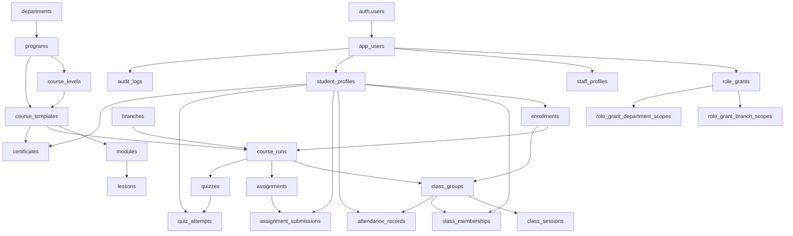

# Nile Learn Production Persistence Architecture

## Purpose

This document defines the production persistence plan for Nile Learn before any
normalized Supabase/Postgres migration becomes shared-environment or runtime
authority.

The platform is in internal alpha stabilization. The current protected baseline
is 1,634 portal QA checks and 0 failures. ADR-011 authorizes full synthetic CRUD
in the dedicated Moodle sandbox. This plan does not activate production Moodle,
EMS, payments, email/SMS/WhatsApp, meetings, or production media storage.
`docs/NILE_LEARN_MASTER_PLAN.md` remains authoritative for sequencing and
provider ownership.

## Sources

- `CLAUDE.md`
- `AGENTS.md`
- `.codex/prompts/00-discovery.md`
- `docs/NILE_LEARN_MASTER_PLAN.md`
- `docs/MODERNIZATION_EXECUTION_CONTRACT.md`
- `docs/internal-admin-workflows.md`
- `docs/qa-baseline.md`
- `client/src/lib/domain/types.ts`
- `client/src/lib/domain/actions.ts`
- `client/src/lib/domain/seed.ts`
- `client/src/lib/domain/store.ts`
- `server/auth.ts`
- `server/sessionRepository.ts`
- `server/sessionStore.ts`
- `server/routes.ts`
- `server/platformState.ts`
- `server/platformRepository.ts`

Supabase planning rules used:

- Enable RLS on exposed tables.
- Do not rely on browser/client state for authorization.
- Do not put authorization facts in user-editable metadata.
- Use server-owned `app_users`, role-grant, permission, and scope tables for
  authorization. Supabase `app_metadata` is never role/scope authority; the
  alpha compatibility path must remain isolated until it is retired.
- Avoid `TO authenticated` policies without row predicates.
- Add indexes on foreign keys and RLS predicate columns.
- Keep service credentials server-side only.

## Current State Map

### Current Authority

The current application authority is a server-side platform snapshot:

- `server/platformRepository.ts` defines the `PlatformRepository` boundary.
- The default adapter reads/writes the current snapshot shape and can fall back
  to local `.local-data/platform-state.json`; on Vercel the local path is
  ephemeral.
- `server/platformState.ts` is the server-side action gate. It parses workflow actions, derives the actor from the session, checks role/scope, applies domain mutations, persists the next snapshot, and returns a scoped state.
- `client/src/lib/domain/store.ts` uses `localStorage` as a demo cache and syncs actions through `/api/platform/state/actions`.

### Current Persistence Shape

Current server persistence stores one denormalized `PlatformState` snapshot plus optional event rows.

Current `PlatformState` includes:

- identity: `users`, `staffProfiles`, `permissions`
- organization: `branches`, `departments`
- academics: `programs`, `levels`, `courses`, `modules`, `lessons`, `resources`, `courseRuns`, `classGroups`
- learning: `students`, `teachers`, `enrollments`, `lessonProgress`
- assessments: `assignments`, `assignmentSubmissions`, `quizzes`, `questionBankItems`, `quizQuestionPreviews`, `quizAttempts`, `grades`
- operations: `events`, `classSessions`, `teacherAvailability`, `rooms`, `meetingLinks`, `attendance`
- admissions: `leads`, `applications`, `placementTests`, `placementResults`, `enrollmentWorkflows`
- finance: `invoices`, `payments`, `packages`, `discounts`
- certificates: `certificates`
- Quran: `quranPlans`, `quranProgress`, `recitationSubmissions`
- communication: `messages`, `communicationLogs`, `messageTemplates`, `documents`, `notifications`, `supportTickets`
- reporting/evidence: `reportPresets`, `auditLogs`
- platform: `settings`, `integrations`

### Current Gaps

- Snapshot persistence is not normalized.
- Whole-snapshot replacement has last-writer-wins concurrency risk and cannot
  provide granular transactions.
- Snapshot normalization merges demo seed data, which must never happen in a
  production authority path.
- Production persistence can currently degrade to local/ephemeral state instead
  of failing closed.
- Memory-backed sessions remain the runtime default. A non-default normalized
  Supabase adapter passes disposable-local PostgREST integration tests but is
  not activated for linked/shared runtime use.
- Client `localStorage` still exists as a demo cache.
- Supabase Auth can sign in, but normalized profile/role tables are not yet the production authority.
- External integrations are placeholders.
- File/media records store URLs only; production storage is not wired.
- The Phase 1 identity/scope/session/audit tables exist only in local migration
  history. They use forced RLS, revoked browser grants, and intentionally no
  browser policies. Later workflow tables and their scoped projections do not
  exist yet, and no normalized table is runtime-authoritative.
- Normalized sessions are intentionally blocked from legacy snapshot workflows
  until normalized repositories exist.

## Target Architecture

The target architecture preserves the current product relationship model:

`User -> Role -> Profile -> Branch/Department Scope -> Permissions -> Portal Access -> Workflow Actions -> Audit Logs`

Student relationship:

`Student -> Branch -> Placement/Level -> Enrollment -> Course -> Class/Group -> Teacher -> Attendance -> Assignments/Quizzes -> Grades -> Certificate`

Teacher relationship:

`Teacher -> Branch -> Department -> Subjects -> Availability -> Classes -> Students through Classes -> Attendance -> Grading -> Feedback`

### Hard Production Contracts

- Production persistence fails closed; local fallback is development and QA
  behavior only.
- Production reads never merge demo seed records.
- Every write uses a transaction and an expected version or equivalent
  concurrency control.
- The domain change, immutable audit event, and outbox event commit atomically.
- Retried commands and provider jobs use idempotency keys.
- Exactly one system is writable for each field at a time.
- A missing `auth.users -> app_users` mapping returns 403 and never resolves to
  a demo identity.

### Data Authority

| Data family                                                                                                 | Writable authority                      |
| ----------------------------------------------------------------------------------------------------------- | --------------------------------------- |
| Identity, roles, scopes, admissions, students, delivery, attendance, finance, certificates, messages, audit | Nile Learn                              |
| Moodle-managed content, activities, completion, attempts, grades, feedback                                  | Moodle                                  |
| Legacy Nile-native learning records                                                                         | Compatibility read model only           |
| Legacy EMS records                                                                                          | Legacy EMS during finite migration only |

Legacy EMS has no recurring synchronization or outbound writeback. Moodle data
is exposed through scoped projections; updates use typed, audited Moodle CRUD
commands or authenticated native launches.

### Server Boundary

Production writes must flow through server actions or server repository methods.

Browser clients may read their scoped data, but they must not be the authority for:

- role
- permission
- branch scope
- department scope
- actor identity
- ownership
- session expiry
- student/class/teacher assignment
- payment status
- certificate status
- audit logs

### Repository Boundary

`PlatformRepository` should evolve in phases:

1. Current adapter: snapshot/local fallback.
2. Read-model adapter: normalized Postgres reads mapped back into `PlatformState`.
3. Workflow adapter: one approved domain family writes transactionally to
   normalized tables while snapshot output is generated only as a compatibility
   read model.
4. Normalized adapter: normalized Postgres is the sole source of truth;
   snapshot is removed or kept only as a non-authoritative export/debug artifact.

There must never be two independent writable authorities. Shadow comparisons
may compare outputs, but they must not create unconstrained dual writes.

The repository interface should stay focused on domain operations, not table names. Later adapters should expose methods such as:

- `getScopedState(session)`
- `runAction(action, session)`
- `createUser(input, actor)`
- `createStudent(input, actor)`
- `saveAttendance(input, actor)`
- `gradeSubmission(input, actor)`
- `approveCertificate(input, actor)`
- `writeAudit(input)`

## Proposed Normalized Tables

The reviewed Phase 1 package is:

- `docs/supabase-phase-1-identity-session-rls-draft.sql`
- `docs/supabase-phase-1-identity-session-rls-rollback.sql`
- `docs/supabase-phase-1-identity-session-rls-assertions.sql`
- `supabase/migrations/20260710053837_phase1_identity_scope_session_audit_mapping.sql`
- `supabase/seed.sql`
- `scripts/validate-phase1-schema.mjs`
- `scripts/validate-phase1-pglite.mjs`
- `scripts/validate-phase1-supabase.sh`

The reviewed draft and promoted local migration must remain byte-for-byte
equivalent. The current application runtime and remote database remain
unchanged. The migration has been reset, asserted, rolled back, reapplied,
seeded with fake data, and linted on a disposable local Supabase Postgres stack;
it has not been applied to a linked or shared project.

`npm run check:phase1-schema:runtime` supplies a reproducible in-memory
PostgreSQL gate: forward, assertions, rollback, clean-state inspection, reapply,
and a second assertion pass. A Supabase CLI stack and advisors remain required
before remote promotion because PGlite does not reproduce the managed Supabase
runtime.

Naming rules:

- Use lowercase snake_case table and column names.
- Use UUID primary keys for production-created rows.
- Keep legacy/demo IDs only in seed/demo mapping columns during migration.
- Add `created_at`, `updated_at`, and where useful `created_by`, `updated_by`.
- Index every foreign key.
- Index every RLS predicate column, especially `user_id`, `branch_id`, `department_id`, `student_id`, `teacher_id`, `course_run_id`, and `class_group_id`.

### Identity And Access

| Table                          | Purpose                                           | Key columns                                                                                       |
| ------------------------------ | ------------------------------------------------- | ------------------------------------------------------------------------------------------------- |
| `app_users`                    | Server-owned app identity mapped to Supabase Auth | `id`, `auth_user_id`, `full_name`, `email`, `phone`, `status`                                     |
| `role_grants`                  | Effective-dated multi-role assignment             | `id`, `user_id`, `role`, `status`, `starts_at`, `ends_at`, `granted_by`                           |
| `permissions`                  | Valid permission catalog                          | `code`, `category`, `description`, `sensitive`                                                    |
| `role_permissions`             | Role-default permission matrix                    | `role`, `permission_code`, `granted`, `updated_by`                                                |
| `staff_profiles`               | Shared staff profile                              | `id`, `user_id`, `title`, `availability_status`, `status`                                         |
| `role_grant_branch_scopes`     | Branch scope join table                           | `id`, `role_grant_id`, `branch_id`                                                                |
| `role_grant_department_scopes` | Department scope join table                       | `id`, `role_grant_id`, `department_id`                                                            |
| `staff_subjects`               | Teacher/staff subjects and levels                 | `id`, `staff_profile_id`, `subject`, `teaching_level`                                             |
| `auth_sessions`                | Durable revocable application sessions            | `id`, `user_id`, `active_role_grant_id`, `token_hash`, `expires_at`, `revoked_at`, `last_seen_at` |

Rules:

- Supabase `auth.users` owns login identity.
- `app_users.auth_user_id` references `auth.users.id` where available.
- Authorization uses `app_users`, `role_grants`, and scope tables, not browser
  claims.
- Supabase Auth `app_metadata` may cache role IDs for UX, but database/server profile tables remain authoritative.

### Organization

| Table                 | Purpose                           | Key columns                                           |
| --------------------- | --------------------------------- | ----------------------------------------------------- |
| `branches`            | Branches and online/global scopes | `id`, `name`, `code`, `timezone`, `address`, `status` |
| `departments`         | Academic/admin departments        | `id`, `name`, `code`, `status`                        |
| `department_branches` | Department branch coverage        | `id`, `department_id`, `branch_id`                    |

### Academic Catalog

| Table                           | Purpose                      | Key columns                                                                 |
| ------------------------------- | ---------------------------- | --------------------------------------------------------------------------- |
| `programs`                      | Program family               | `id`, `title`, `category`, `department_id`, `language`, `status`            |
| `course_levels`                 | Level ladder inside programs | `id`, `program_id`, `title`, `sort_order`                                   |
| `course_level_prerequisites`    | Level prerequisites          | `id`, `level_id`, `prerequisite_level_id`                                   |
| `course_level_completion_rules` | Completion rules             | `id`, `level_id`, `rule`                                                    |
| `course_templates`              | Reusable course definition   | `id`, `program_id`, `level_id`, `slug`, `title`, `description`, `status`    |
| `course_outcomes`               | Course outcomes              | `id`, `course_template_id`, `outcome`, `sort_order`                         |
| `curriculum_versions`           | Publishable course version   | `id`, `course_template_id`, `version`, `status`, `published_at`             |
| `modules`                       | Versioned curriculum modules | `id`, `curriculum_version_id`, `title`, `sort_order`                        |
| `module_outcomes`               | Module outcomes              | `id`, `module_id`, `outcome`, `sort_order`                                  |
| `lessons`                       | Lessons                      | `id`, `module_id`, `title`, `lesson_type`, `duration_minutes`, `sort_order` |
| `lesson_resources`              | Resource metadata only       | `id`, `lesson_id`, `title`, `resource_type`, `url`, `published`             |

Resource URLs remain placeholders until production file/media storage is approved.

### Classes And Scheduling

| Table                  | Purpose                            | Key columns                                                                                                         |
| ---------------------- | ---------------------------------- | ------------------------------------------------------------------------------------------------------------------- |
| `course_runs`          | Course offering in term/branch     | `id`, `course_template_id`, `curriculum_version_id`, `branch_id`, `term`, `starts_on`, `ends_on`, `status`          |
| `class_groups`         | Delivery and roster group          | `id`, `course_run_id`, `name`, `capacity`, `status`                                                                 |
| `class_memberships`    | Effective-dated student membership | `id`, `class_group_id`, `student_id`, `status`, `starts_at`, `ends_at`                                              |
| `teacher_assignments`  | Effective-dated teacher assignment | `id`, `class_group_id`, `teacher_id`, `assignment_type`, `starts_at`, `ends_at`, `status`                           |
| `class_schedules`      | Recurring class schedule rule      | `id`, `class_group_id`, `weekday`, `starts_at`, `ends_at`, `room_id`, `timezone`, `effective_from`, `effective_to`  |
| `class_sessions`       | Materialized delivery session      | `id`, `class_group_id`, `schedule_id`, `title`, `starts_at`, `ends_at`, `room_id`, `status`, `attendance_saved`     |
| `calendar_events`      | Calendar source event              | `id`, `event_type`, `title`, `starts_at`, `ends_at`, `owner_id`, `branch_id`, `room_id`, `class_group_id`, `status` |
| `teacher_availability` | Teacher availability block         | `id`, `teacher_id`, `weekday`, `starts_at`, `ends_at`, `branch_id`                                                  |
| `rooms`                | Branch room                        | `id`, `branch_id`, `name`, `capacity`, `status`                                                                     |
| `room_equipment`       | Room equipment item                | `id`, `room_id`, `equipment`                                                                                        |
| `meeting_links`        | Placeholder meeting metadata       | `id`, `provider`, `url`, `status`                                                                                   |

### Students And Admissions

| Table                     | Purpose                   | Key columns                                                                                                                                                                                                        |
| ------------------------- | ------------------------- | ------------------------------------------------------------------------------------------------------------------------------------------------------------------------------------------------------------------ |
| `student_profiles`        | Student profile           | `id`, `user_id`, `status`, `source`, `guardian_name`, `guardian_phone`, `current_level`, `age_group`, `course_interest`, `country`, `preferred_language`, `timezone`, `notes`                                      |
| `leads`                   | Lead intake               | `id`, `full_name`, `email`, `phone`, `country`, `subject`, `source`, `status`, `notes`, `created_at`                                                                                                               |
| `applications`            | Application file          | `id`, `lead_id`, `branch_id`, `course_interest`, `schedule_preference`, `status`                                                                                                                                   |
| `placement_test_bookings` | Placement booking         | `id`, `lead_id`, `full_name`, `email`, `phone`, `branch_id`, `subject`, `preferred_date`, `current_level`, `status`, `recommended_level`                                                                           |
| `placement_test_results`  | Placement outcome         | `id`, `booking_id`, `examiner_id`, `score`, `recommended_level`, `notes`, `created_at`                                                                                                                             |
| `enrollment_workflows`    | Admissions workflow state | `id`, `lead_id`, `application_id`, `student_id`, `placement_test_id`, `target_course_id`, `course_run_id`, `target_level_id`, `recommended_level`, `class_group_id`, `source`, `status`, `next_step`, `updated_at` |
| `enrollments`             | Active/past enrollment    | `id`, `student_id`, `course_run_id`, `level_id`, `class_group_id`, `source`, `status`, `progress`, `attendance_rate`, `current_grade`, `created_at`                                                                |

### Learning Progress And Assessment

| Table                        | Purpose                 | Key columns                                                                                                        |
| ---------------------------- | ----------------------- | ------------------------------------------------------------------------------------------------------------------ |
| `lesson_progress`            | Student lesson state    | `id`, `student_id`, `lesson_id`, `status`, `completed_at`, `notes`                                                 |
| `assignments`                | Assignment config       | `id`, `course_run_id`, `title`, `due_at`, `submission_type`, `status`                                              |
| `assignment_rubric_items`    | Assignment rubric lines | `id`, `assignment_id`, `rubric_item`, `sort_order`                                                                 |
| `assignment_submissions`     | Student submissions     | `id`, `assignment_id`, `student_id`, `submitted_at`, `status`, `response`, `score`, `feedback`                     |
| `quizzes`                    | Quiz config             | `id`, `course_run_id`, `title`, `due_at`, `duration_minutes`, `attempts_allowed`, `status`                         |
| `question_bank_items`        | Question bank           | `id`, `course_run_id`, `prompt`, `question_type`, `difficulty`, `answer_key`, `created_by`, `updated_at`, `status` |
| `question_bank_choices`      | Question choices        | `id`, `question_id`, `choice`, `sort_order`                                                                        |
| `question_bank_tags`         | Question tags           | `id`, `question_id`, `tag`                                                                                         |
| `question_bank_rubric_items` | Question rubric items   | `id`, `question_id`, `rubric_item`, `sort_order`                                                                   |
| `quiz_questions`             | Quiz-question join      | `id`, `quiz_id`, `question_id`, `sort_order`                                                                       |
| `quiz_attempts`              | Student attempts        | `id`, `quiz_id`, `student_id`, `started_at`, `submitted_at`, `status`, `score`, `max_score`                        |
| `quiz_attempt_answers`       | Attempt answers         | `id`, `attempt_id`, `question_id`, `answer`                                                                        |
| `grades`                     | Gradebook rows          | `id`, `student_id`, `course_run_id`, `item_id`, `item_title`, `score`, `max_score`, `feedback`                     |

### Attendance

| Table                | Purpose            | Key columns                                                           |
| -------------------- | ------------------ | --------------------------------------------------------------------- |
| `attendance_records` | Session attendance | `id`, `class_group_id`, `student_id`, `session_id`, `status`, `notes` |

Constraints:

- Unique attendance record per `class_group_id`, `student_id`, `session_id`.
- `student_id` must belong to the `class_group_id` roster.
- Teacher writes must go through an active `teacher_assignments` row for the
  class and session time.
- Branch admin writes must be branch scoped through `course_runs.branch_id`.

### Finance

| Table       | Purpose                   | Key columns                                                              |
| ----------- | ------------------------- | ------------------------------------------------------------------------ |
| `packages`  | Internal package catalog  | `id`, `title`, `course_id`, `amount`, `currency`, `sessions`, `status`   |
| `discounts` | Internal discount catalog | `id`, `code`, `amount`, `currency`, `status`                             |
| `invoices`  | Internal invoice records  | `id`, `student_id`, `amount`, `currency`, `due_at`, `status`             |
| `payments`  | Internal payment records  | `id`, `invoice_id`, `amount`, `method`, `reference`, `paid_at`, `status` |

No payment gateway is part of this phase.

### Certificates

| Table          | Purpose                          | Key columns                                                                                                                                                                                          |
| -------------- | -------------------------------- | ---------------------------------------------------------------------------------------------------------------------------------------------------------------------------------------------------- |
| `certificates` | Certificate approval/issue state | `id`, `student_id`, `course_id`, `status`, `grade`, `attendance_rate`, `verification_code`, `approved_by`, `approved_at`, `issued_by`, `issued_at`, `rejected_by`, `rejected_at`, `rejection_reason` |

Constraints:

- `verification_code` unique.
- Issued certificates are public-verifiable by code only through a restricted read path.

### Quran

| Table                      | Purpose                       | Key columns                                                                       |
| -------------------------- | ----------------------------- | --------------------------------------------------------------------------------- |
| `quran_memorization_plans` | Student Quran plan            | `id`, `student_id`, `target`, `current_juz`, `revision_cycle`, `teacher_id`       |
| `quran_progress_records`   | Progress by surah/juz         | `id`, `student_id`, `surah`, `juz`, `memorized_percent`, `tajweed_score`, `notes` |
| `recitation_submissions`   | Recitation review placeholder | `id`, `student_id`, `teacher_id`, `title`, `submitted_at`, `status`, `feedback`   |

Audio/video storage is future work.

### Communication

| Table                | Purpose                         | Key columns                                                                               |
| -------------------- | ------------------------------- | ----------------------------------------------------------------------------------------- |
| `messages`           | In-app messages                 | `id`, `from_user_id`, `to_user_id`, `subject`, `body`, `read`, `created_at`               |
| `communication_logs` | Internal communication evidence | `id`, `actor_id`, `channel`, `subject`, `body`, `related_user_id`, `status`, `created_at` |
| `message_templates`  | Template library                | `id`, `title`, `channel`, `subject`, `body`, `category`, `status`                         |
| `notifications`      | In-app notifications            | `id`, `user_id`, `title`, `body`, `href`, `read`, `created_at`                            |
| `support_tickets`    | Internal support requests       | `id`, `requester_id`, `subject`, `status`, `priority`, `last_updated_at`                  |

No external email/SMS/WhatsApp sending is part of this phase.

### Documents And Media Metadata

| Table       | Purpose       | Key columns                                                 |
| ----------- | ------------- | ----------------------------------------------------------- |
| `documents` | Metadata only | `id`, `owner_id`, `title`, `document_type`, `url`, `status` |

Production storage buckets and signed URLs are future work.

### Reports, Audit, Settings, Integrations

| Table                     | Purpose                                           | Key columns                                                                                                              |
| ------------------------- | ------------------------------------------------- | ------------------------------------------------------------------------------------------------------------------------ |
| `report_presets`          | Saved report views                                | `id`, `owner_user_id`, `role`, `label`, `report_type`, `search`, `status`, `row_count`, `created_at`                     |
| `audit_logs`              | Immutable audit evidence                          | `id`, `actor_id`, `action`, `entity_type`, `entity_id`, `summary`, `created_at`, `before_json`, `after_json`             |
| `command_executions`      | Command idempotency and actor evidence            | `id`, `idempotency_key`, `actor_user_id`, `actor_role_grant_id`, `session_id`, `command_type`, `status`                  |
| `outbox_events`           | Transactional provider/job queue                  | `id`, `event_type`, `aggregate_type`, `aggregate_id`, `payload`, `idempotency_key`, `status`, `attempts`, `next_at`      |
| `integration_connections` | Server-observed provider connection               | `id`, `provider`, `label`, `environment`, `status`, `capabilities`, `last_verified_at`                                   |
| `integration_env_vars`    | Expected env var names only                       | `id`, `connection_id`, `env_var`                                                                                         |
| `external_records`        | Internal-to-provider mapping                      | `id`, `provider`, `entity_type`, `internal_id`, `external_id`, `external_parent_id`, `source_hash`, `sync_state`         |
| `sync_cursors`            | Incremental provider watermark                    | `id`, `connection_id`, `entity_type`, `cursor`, `updated_at`                                                             |
| `sync_runs`               | Durable synchronization run                       | `id`, `connection_id`, `direction`, `status`, `started_at`, `finished_at`, `cursor_before`, `cursor_after`               |
| `sync_run_items`          | Item result and retry evidence                    | `id`, `sync_run_id`, `external_record_id`, `status`, `error_class`, `error_detail`                                       |
| `reconciliation_cases`    | Human-review mapping conflict                     | `id`, `provider`, `entity_type`, `internal_id`, `external_id`, `reason`, `status`, `resolved_by`, `resolved_at`          |
| `migration_runs`          | Finite legacy EMS migration evidence              | `id`, `source`, `entity_type`, `watermark`, `status`, `source_count`, `imported_count`, `exception_count`, `approved_by` |
| `migration_evidence`      | Append-only migration approvals and cutover proof | `id`, `migration_run_id`, `evidence_type`, `evidence_hash`, `recorded_by`, `recorded_at`                                 |
| `platform_settings`       | Global settings                                   | `id`, `organization`, `default_language`, `academic_term`, `retention_days`, `updated_at`, `updated_by`                  |

Integration tables must never store provider secrets in browser-visible
columns. A `connected` status is derived from a server capability check, not a
manual UI field.

## Entity Relationship Summary

## RLS And Security Boundary Plan

### General RLS Rules

- Enable RLS on every application table in any exposed schema.
- Prefer private schemas for helper functions and internal lookup helpers.
- Phase 1 normalized base tables are server-only: revoke direct `anon` and
  `authenticated` table privileges and define no browser policies.
- Protected reads and writes go through server APIs that resolve an opaque Nile
  session and exactly one active role grant. A Supabase Auth JWT alone is not a
  Nile authorization context.
- Any later browser-readable projection requires a separate accepted decision,
  purpose-built view/policy, and denial tests; it must never union grants.
- Add indexes for all RLS predicate columns.
- Never base RLS on `raw_user_meta_data`.
- Avoid public `SECURITY DEFINER` functions. Server-only helpers live in a
  private schema, set `search_path = ''`, and revoke execute from browser roles.

### Helper Tables For RLS

Supabase `auth.uid()` is used only during sign-in/account mapping or by a future
purpose-built projection. Protected Nile requests resolve the opaque application
session first, then use its single `user_id` and `active_role_grant_id` through:

- `auth_sessions.user_id` and `auth_sessions.active_role_grant_id`
- `app_users.auth_user_id` for the initial Supabase Auth-to-app mapping
- `role_grants.user_id`
- `role_grant_branch_scopes.branch_id`
- `role_grant_department_scopes.department_id`
- `student_profiles.user_id`
- class and enrollment joins for student/teacher ownership

### Role Access Model

The permissions below describe scoped server API behavior, not direct browser
table grants.

Student:

- May read own `student_profiles`, enrollments, class groups through enrollment, assigned learning records, own attendance, own grades, own certificates, own Quran records, own messages/notifications.
- May insert/update only own learning actions through server actions, not direct broad table writes.

Teacher:

- May read assigned course runs/classes and students through class roster/enrollments.
- May save attendance only for assigned class sessions.
- May grade/review only submissions/attempts for assigned class students.
- May update Quran progress/recitation review only for assigned students.

Registrar:

- May manage leads, applications, placement, students, enrollments, and internal payments within assigned branch/admissions scope.
- Must not access branch/admin/global settings outside scope.

HOD:

- May read department courses, teachers, classes, assessments, certificates, and academic reports within department/branch scope.
- May approve/reject academic/certificate items in scope.

Branch admin:

- May read branch users, rooms, schedule, class operations, attendance exceptions, internal payments, and branch reports for assigned branch.
- Must not edit global settings or curriculum unless a future permission explicitly allows it.

Super admin:

- May manage all internal data.
- Sensitive writes must create audit logs.

### Public/Anon Access

Anon access should be limited to:

- public catalog read models, if exposed intentionally
- certificate verification by code through a controlled endpoint or tightly scoped view
- public lead/application/placement intake through server endpoints with validation and rate limiting

Anon must not have direct table access to operational, financial, learning, profile, or audit data.

## Server-Authoritative Data

These must become server-authoritative in normalized persistence:

- users, roles, permissions
- branches, departments, scopes
- student and staff profiles
- leads, applications, placement results, enrollment workflows
- enrollments, course runs, class groups, memberships, assignments, schedules,
  and sessions
- Nile-owned attendance, submissions, attempts, and grades
- invoices, payments
- certificates and verification codes
- messages, notifications, communication logs
- audit logs
- provider mappings, synchronization evidence, migration evidence, and platform
  settings

Moodle-managed content, attempts, and grades remain authoritative in Moodle.
Nile Learn reads scoped projections and submits edits only through typed,
audited Moodle CRUD commands or authenticated native launches. They are never
silently converted into Nile-owned records.

## Local/Demo-Only Data

These may remain local/demo-only during alpha:

- seed data fixtures
- portal QA fixture reset state
- local demo users and short test emails
- client `localStorage` cache for demo UX
- `.local-data/platform-state.json`
- snapshot compatibility tables used only for migration comparison

## Client `localStorage` Rules

Allowed:

- cache scoped demo state for local alpha and QA only
- store non-authoritative UI preferences
- preserve draft form values if they do not include secrets
- drive local QA flows

Production clients may use local storage for non-sensitive UI preferences and
safe unsent drafts only. Production server state must never be hydrated from a
client snapshot.

Not allowed:

- authorize roles or permissions
- determine branch/department scope
- decide student/teacher ownership
- store service keys or provider secrets
- mark payments/certificates/grades as authoritative
- override server action results
- act as production session storage

## Migration Sequence

Phase numbers follow `docs/NILE_LEARN_MASTER_PLAN.md`.

### Phase 0: Protected Alpha Baseline

Status: completed.

- Historical tag: `alpha-qa-921-0-2026-07-04`.
- Current protected baseline: 1,205 checks and 0 failures.
- Add server-side RBAC/scope tests.
- Add `PlatformRepository` boundary.

### Phase 1: Identity And Scope Migration Package

Status: locally promoted and verified; no application runtime or remote database
behavior change.

- Maintain the bounded Phase 1 migration for identity, organization, durable sessions,
  command/audit/outbox evidence, external mappings, synchronization evidence,
  reconciliation, and finite migration controls only. Domain workflow tables
  belong to their later master-plan phases.
- Enable and force RLS, revoke browser privileges, and keep Phase 1 base tables
  policy-free/server-only.
- Add indexes for all foreign keys and authority lookup columns.
- Keep the deterministic seed fake-only.
- Preserve static, PGlite, local Supabase reset, semantic assertion, rollback,
  and lint gates.
- Run managed-project advisors and a remote dry run before applying to a shared
  environment.

### Phase 2: Durable Sessions And Auth Authority

Complete before normalized workflow writes:

- Map Supabase users exactly to `app_users`.
- Persist revocable sessions or verify Supabase sessions server-side on every
  request.
- Resolve active role through an active role grant.
- Refresh permissions and scopes server-side for sensitive actions.
- Return 403 for missing, inactive, revoked, or ambiguous mappings.

### Phase 3: Repository Read Adapter

Keep behavior equivalent.

- Add a Postgres-backed adapter behind `PlatformRepository`.
- Map normalized reads back into the existing `PlatformState` read model.
- Keep the snapshot adapter as default unless explicitly enabled.
- Add parity tests comparing seed snapshot output with normalized read output.

### Phases 4-9: Server Action Writes By Domain

Keep client routes stable.

- Move one workflow family at a time.
- Commit each domain change, audit event, and outbox event atomically.
- Require expected versions and idempotency keys where retries are possible.
- Preserve routes while replacing the authority beneath them.
- Prove domain, repository, RLS, API, and portal parity before the next family.

### Snapshot Retirement

Only after parity is proven:

- Stop writing snapshot as primary state.
- Keep snapshot export only for QA/debug if still useful.
- Remove assumptions that all data can be loaded as one large `PlatformState`.

### Phase 6: Moodle Projection And CRUD Command Foundation

Only after normalized identity, durable sessions, RLS, repository reads, and
reconciliation tables are stable:

- import Moodle mappings and scoped projections;
- record cursors, runs, item errors, and reconciliation cases;
- prove repeated synchronization is idempotent;
- prove full synthetic CRUD in the dedicated sandbox through exact mappings,
  commands, read-back, reconciliation, archive/restore, and cleanup;
- keep production portal activation disabled until each operation family is
  accepted.

### Phase 11: Finite Legacy EMS Migration

- Run dry imports against immutable exports or an approved read-only source.
- Reconcile counts, relationships, balances, and sampled records.
- Require human approval and a rollback window.
- Perform a final delta import, cut over, then retire EMS credentials.
- Do not implement recurring EMS sync or outbound writeback.

Payment, outbound communication, meetings, and production media remain separate
future provider phases after the internal foundation is complete.

## Tests Needed Before Shared-Environment Or Runtime Promotion

Repository parity:

- normalized adapter returns the same shape as the snapshot adapter for seeded data
- action results match existing domain action results
- audit logs are written for every sensitive action

RLS and scope:

- student cannot read another student profile, attendance, grades, certificates, messages, or Quran records
- teacher cannot read or mutate unrelated classes/students
- registrar cannot create/convert/update outside branch scope
- HOD cannot access finance/global settings or unrelated department data
- branch admin cannot access other branches or global admin settings
- super admin can perform global actions

Workflow:

- lead/application -> placement -> student -> enrollment -> class -> active portal
- teacher assignment -> class roster -> attendance -> grading -> feedback
- registrar payment record links to invoice/enrollment/student
- HOD certificate approval/rejection/issue state transitions
- branch room/schedule/attendance exception flows
- admin user/role/permission/audit flows

Performance:

- indexes exist for all foreign keys
- indexes exist for all RLS predicates
- report queries paginate
- large audit/report reads avoid loading full state

Migration safety:

- seed fake demo data only
- migration can be rolled back in local/dev
- data backfill preserves current demo relationships
- production outage does not fall back to local or demo state
- missing auth/profile mappings fail with 403
- concurrent writes cannot silently overwrite one another
- domain, audit, and outbox rows are atomic
- provider retries are idempotent
- portal QA remains at the accepted 1,205/0 baseline after each adapter phase

## Files Likely To Change Later

- `supabase/migrations/*`
- `supabase/seed.sql` or dedicated seed scripts
- `server/platformRepository.ts`
- `server/platformState.ts`
- `server/auth.ts`
- `server/sessionRepository.ts`
- `server/sessionStore.ts`
- `server/routes.ts`
- `server/supabase.ts`
- `client/src/lib/domain/types.ts`
- `client/src/lib/domain/actions.ts`
- `client/src/lib/domain/store.ts`
- `client/src/lib/auth/server-platform-repository.test.ts`
- `client/src/lib/auth/server-platform-state.test.ts`
- `client/src/lib/domain/store.test.ts`
- portal QA scripts under `scripts/`

## Risks And Rollback Plan

Risks:

- Accidental role/scope widening in RLS.
- Slow RLS policies on large tables.
- Compatibility projection divergence between snapshot-shaped reads and
  normalized tables.
- Client code assuming all state is loaded at once.
- Auth/session drift between Supabase identity and app profile tables.
- Audit logs becoming incomplete during migration.
- Stale Moodle mappings silently presenting wrong learning data.
- Legacy EMS imports duplicating or mis-linking identities and financial rows.

Rollback:

- Keep snapshot adapter as default until normalized adapter proves parity.
- Gate Postgres adapter behind an explicit server env flag.
- Preserve `scripts/verify.sh` and portal QA as migration gates.
- Use one workflow per migration slice.
- If parity or QA fails, switch back to snapshot adapter and inspect the failing workflow before continuing.

## Execution Sequence Authority

The current checkpoint and only approved next implementation slice live in
`docs/NILE_LEARN_MASTER_PLAN.md` under **Current Modernization Checkpoint**.
This architecture document defines the target schema and safety boundaries; it
does not independently authorize migration, adapter activation, remote
promotion, or workflow cutover.
